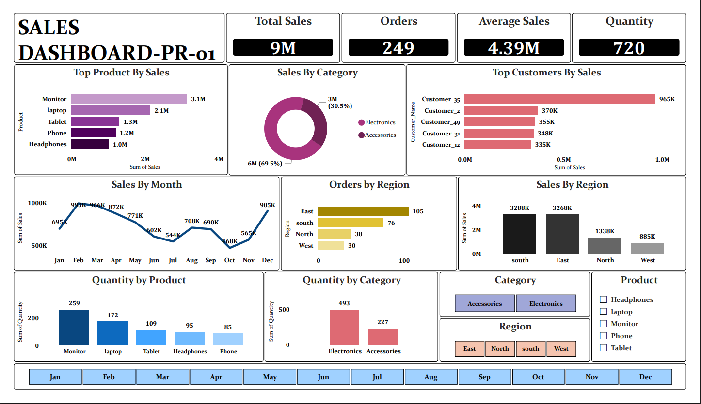
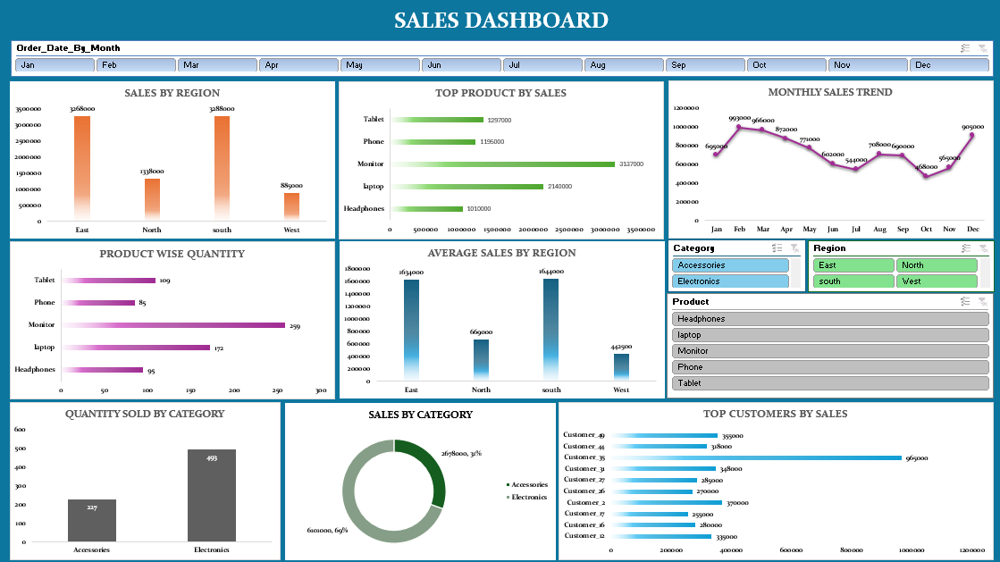

# 📊 Sales Data Analysis Dashboard

## 📌 Project Overview

This project focuses on analyzing sales data and creating an interactive dashboard using **Microsoft Excel and Power BI**.

The dashboard provides insights into sales performance across regions, categories, products, customers, and months.

## 🛠️ Tools & Technologies

* Microsoft Excel
* Power BI
* Python
* Pandas
* SQL
* Matplotlib
* Excel Formulas
* VLOOKUP & HLOOKUP
* Data Cleaning
* Data Visualization
* Exploratory Data Analysis

## 📂 Project Structure

```text
Sales-Data-Analysis-Dashboard/
│
├── Dataset/
│   └── Cleaned_Sales_Dataset.csv
│
├── Excel/
│   └── Sales_Dashboard.xlsx
│
├── PowerBI/
|   └── Sales_Dashboard.pbix
|
├── SQL/
│   └── Sales_Dataset_Queries.sql
|
├── Python/
│   └── sales_dataset.py
│
└── Images/
    └── sales_dashboard.png
```

## 📊 Dashboard Highlights

* **Total Sales:** 9M
* **Total Orders:** 249
* **Total Quantity:** 720
* **Average Sales:** 4.39M
* Sales analysis by region
* Monthly sales trend
* Sales by category
* Top products by sales
* Top customers by sales
* Quantity by product
* Orders by region

## 📈 Key Analysis

### Regional Analysis

Sales and order performance were analyzed across **East, North, South, and West** regions.

### Monthly Sales Analysis

Monthly sales were visualized from **January to December** to understand sales trends throughout the year.

### Product Analysis

Products were compared based on sales and quantity to identify the strongest-performing products.

### Customer Analysis

Top customers were identified based on their total sales contribution.

### Category Analysis

Sales and quantity were analyzed across **Electronics and Accessories** categories.

## 📊 Power BI Dashboard



The Power BI dashboard provides interactive analysis of sales performance by region, month, product, customer, and category.

## 📈 Excel Dashboard



The Excel dashboard includes sales analysis using charts, formulas, Pivot Tables, VLOOKUP, and HLOOKUP.

## 🧮 Excel Analysis

Excel was used for:

* Data analysis
* Pivot tables
* Charts
* Formulas
* VLOOKUP
* HLOOKUP
* Sales calculations
* Category and regional analysis

## 🐍 Python Analysis

Python was used for basic data analysis and visualization using:

* Pandas
* Matplotlib

Visualizations include sales by category, sales by region, monthly sales trends, sales distribution, and price versus sales.

## 🎯 Project Objective

The main objective of this project is to transform sales data into meaningful business insights through **data cleaning, analysis, visualization, and dashboard development**.

## 👨‍💻 Author

**Aneesh M A**

Aspiring Data Analyst

Skills: Excel | Power BI | SQL | Python | Data Analysis | Data Visualization
